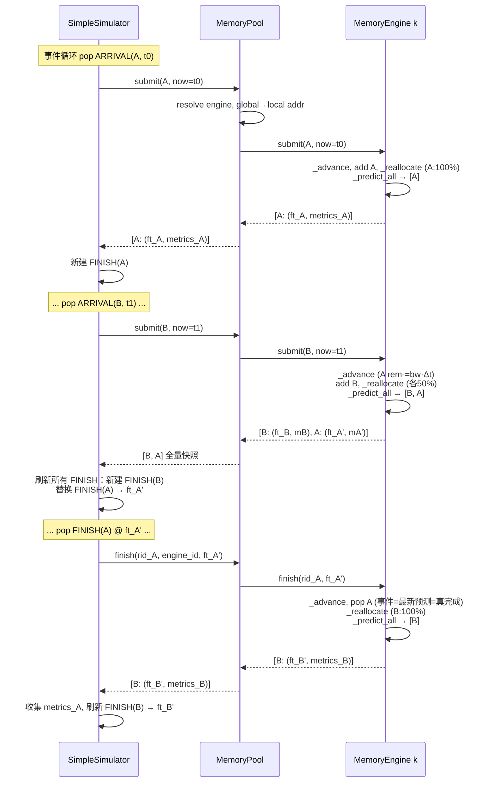

# 多实例管理与理论带宽竞争设计方案

## 1. 文档目的

本文给出 MemEngine 多实例管理和第一阶段访存竞争仿真的完整设计。

本阶段的目标是：

1. 将一个 `MemoryEngine` 明确定义为一个独立的物理介质实例。
2. 通过新的 `MemoryPool` 管理多个 `MemoryEngine`、全局地址和实例路由。
3. 支持多个上层服务实例（例如多个 prefill server）在不同 arrival time 发起访存。
4. 复用当前 Analytic 后端的带宽理论模型，实现事件驱动的动态带宽分配。
5. 向父项目的离散事件仿真器提供与具体事件框架无关的接口。
6. 保留现有单实例同步 `MemoryEngine.issue_request()` 的使用方式。

本阶段不考虑：

- Ramulator/MQSim 的跨调用竞争或在线增量仿真。
- 一个 tensor 跨多个实例进行 stripe 放置。
- 数据复制、迁移、remote request 或缓存一致性。
- PCIe switch、网络、计算单元等多级共享资源的精确流水和仲裁；第一阶段只允许将瓶颈折叠为 Engine 或 Pool 的一个带宽资源。
- 在本仓库内实现完整的全局离散事件循环。

## 2. 核心设计结论

### 2.1 层级划分

- `MemoryEngine`：单个物理介质实例，持有带宽竞争状态（`active_requests`、`last_update_time`、均分带宽）。预测采用**静态公式**（`now + remaining / allocated_bw`），精确度由 FINISH 回调修正。不维护预测缓存或事件指标。
- `MemoryPool`：多实例地址和路由管理层。`submit(request, now)` 处理 ARRIVAL，`finish(rid, engine_id, now)` 处理 FINISH 回调。不 import `Event`。
- `SimpleSimulator`：事件堆管理 + 最终统计。ARRIVAL 调 `pool.submit()`，FINISH 调 `pool.finish()`。每次状态变更用返回的**全量预测快照**刷新所有 FINISH 事件，事件触发即真完成（stale-skip 丢弃被取代的旧事件）。

### 2.2 从 MemoryEngine 移出的职责

多实例改造完成后，下列职责不再属于 `MemoryEngine`：

- `dp_size` 和 DP 请求复制。
- `storage_instance_num`。
- 跨实例 round-robin。
- 池级全局地址空间。
- 池级全局请求计数。

DP 语义应由上层 workload 或父项目服务拓扑表达；多实例数量、地址空间和请求路由由 `MemoryPool` 表达。

### 2.3 地址语义

- 直接调用 `MemoryEngine` 时，地址是该实例的 local byte address。
- 通过 `MemoryPool` 调用时，地址始终是 pool global byte address。
- `MemoryPool.submit()` 可以选择性携带 `mem_engine_id`，但该参数只用于直接定位和归属校验，不改变 `addr` 的 global address 语义。
- 未指定 `mem_engine_id` 时，根据 global address 所在的实例地址窗口进行确定性路由。
- 实例选择发生在数据分配时，而不是每次访问时，避免同一个地址被动态发送到不同实例。

## 3. 整体架构图

```mermaid
flowchart TB
    subgraph SERVICE["上层服务实例"]
        P0["Prefill Server 0"]
        P1["Prefill Server 1"]
        PN["Prefill Server N"]
    end

    subgraph PARENT["父项目离散事件仿真器"]
        DES["SimpleSimulator (或父项目 DES)<br/>事件队列、逐个下发 ARRIVAL、<br/>接收 FINISH 事件列表并替换"]
        ARRIVE["Arrival Events"]
        FINISH["Finish Events (with embedded metrics)"]
        ARRIVE --> DES
        FINISH --> DES
    end

    subgraph POOL_LAYER["MemoryPool：多实例系统层"]
        API["submit(request, now) / get_tensor_addr"]
        ADDR["Global Address Windows<br/>Allocation Policy"]
        ROUTER["Global -> Engine ID + Local Address"]
        API --> ADDR
        ADDR --> ROUTER
    end

    subgraph ENGINE_LAYER["MemoryEngine：单实例层"]
        E0["MemoryEngine 0<br/>local allocator, active requests,<br/>bandwidth state, predictions"]
        E1["MemoryEngine 1<br/>local allocator, active requests,<br/>bandwidth state, predictions"]
        EM["MemoryEngine M<br/>local allocator, active requests,<br/>bandwidth state, predictions"]

        B0["Analytic / Ramulator / MQSim backend 0"]
        B1["Analytic / Ramulator / MQSim backend 1"]
        BM["Analytic / Ramulator / MQSim backend M"]

        E0 --> B0
        E1 --> B1
        EM --> BM
    end

    P0 --> DES
    P1 --> DES
    PN --> DES
    DES --> API
    ROUTER --> E0
    ROUTER --> E1
    ROUTER --> EM
    E0 -.->|[(rid, ft, metrics)]| API
    E1 -.->|[(rid, ft, metrics)]| API
    EM -.->|[(rid, ft, metrics)]| API
```

每个 Engine 独立管理自己的带宽竞争状态。第一阶段只有 Analytic backend 接入事件驱动路径，Ramulator 和 MQSim 保持同步 batch 模式。TODO(phase-2): POOL scope（共享带宽）。

## 4. 模块职责

| 模块 | 核心职责 | 不负责的内容 |
| --- | --- | --- |
| `MemoryEngine` | 单实例 local 地址分配、容量校验、backend 生命周期；持有带宽竞争状态（`_advance`、`_pop_finished`、`_reallocate`、`_predict_all`、`_build_results`） | 多实例数量、跨实例路由、DP 复制、事件队列、最终统计 |
| `MemoryPool` | 实例集合、global 地址窗口、global→local 转换、`submit(request, now)`（ARRIVAL）+ `finish(rid, engine_id, now)`（FINISH）；不做统计 | DRAM/NAND 细节、引擎内部带宽状态、事件队列管理、Event |
| `SimpleSimulator` | 管理事件堆（Event 带 callback）；`schedule_arrival` 用闭包构造回调；`run()` 直接 `event.callback()`；聚合 makespan 和 per-source 指标 | 地址映射、介质请求转换、engine 身份 |
| `des/event.py` | `Event`：`time` + `callback` + `request_id` + `metrics`；无 `EventKind` | — |

## 5. 多实例和地址空间设计

### 5.1 固定全局地址窗口

第一阶段为每个 MemEngine 分配一个互不重叠的 global address window。

假设实例容量为 `C0`、`C1`、`C2`：

```text
MemEngine 0: global [0,       C0)
MemEngine 1: global [C0,      C0+C1)
MemEngine 2: global [C0+C1,   C0+C1+C2)
```

对于实例 `i`：

```text
global_addr = global_base[i] + local_addr
local_addr  = global_addr - global_base[i]
```

实例可以通过对窗口起始地址进行二分查找，或在同构等容量时通过除法快速定位。实现上优先使用统一的窗口表，以便以后支持异构容量。

### 5.2 地址分配

池级接口：

```python
def get_tensor_addr(
    self,
    size_bytes: int,
    *,
    mem_engine_id: int | None = None,
) -> tuple[int, int]:
    """Allocate and return (global_addr, engine_id)."""
```

处理流程：

1. 如果指定 `mem_engine_id`，选择对应实例。
2. 如果未指定，由 pool allocation policy 选择实例。
3. 调用目标 `MemoryEngine.get_tensor_addr()` 分配 local address。
4. 将 local address 转换为 global address 并返回。

当前默认 ROUND_ROBIN：从上次选中的引擎开始扫描，选第一个剩余容量足够的。不支持 LEAST_ALLOCATED。

TODO(phase-2): 可插拔分配策略。

### 5.3 为什么不需要 MemoryRegion

第一阶段规定：

- 一个 allocation 完整落在一个 MemEngine。
- 一次访问不能跨越两个实例的 global window。
- 不支持 stripe、迁移或副本。

因此仅使用 global/local address 和固定窗口即可，不需要 `MemoryRegion`、`MemoryRegionSegment` 或地址片段表。如果后续支持跨实例 stripe，再单独引入这些结构。

### 5.4 地址访问校验

`MemoryPool.submit()` 必须校验每个 arrival 的地址：

- `addr >= 0`。
- `size_bytes > 0`。
- `[addr, addr + size_bytes)` 完整位于某个实例窗口内。
- 如果指定 `mem_engine_id`，地址窗口必须属于该实例。
- local address 转换后不能超过实例容量。

不允许指定一个实例 ID，却用另一个实例窗口中的地址静默访问。

### 5.5 一个请求只访问一个存储节点

第一阶段中，MemoryPool 的策略是数据 placement 策略，而不是每次访问时的负载均衡策略：

```text
一次 allocation      -> 一个 MemoryEngine
一次 memory request  -> 数据所属的一个 MemoryEngine
```

请求不会因为当前实例繁忙而动态发送到其他实例。只有后续显式支持 stripe、数据副本或迁移时，一个逻辑请求才可能拆分到多个存储节点。

### 5.6 介质带宽

每个 Engine 拥有独立的带宽资源，直接使用配置的 `bandwidth`（GB/s）。不区分介质带宽和传输链路带宽——如需建模传输瓶颈，可调节配置的 bandwidth 值。

TODO(phase-2): 如果目标硬件共享传输链路，需引入 POOL scope（共享带宽资源）。

## 6. 核心数据结构和接口

### 6.1 MemoryRequest — 统一请求类型

事件路径和同步路径共用 `MemoryRequest`（它取代了旧的 `MemoryObject` 包装，
字段已全部提升到请求上）：

```python
@dataclass
class MemoryRequest:
    size: int                           # 字节数
    req_type: MemoryRequestType         # 读写类型
    addr: Optional[int] = None          # 地址；KWRITE 可省略（由 pool 分配）
    media_req_num: int = 0              # 按 granularity 分解的估计数量
    media_request_list: List["MediaRequest"] = field(default_factory=list)
                                        # 分解后的介质请求（由 backend 填充）

    # 事件路径字段
    request_id: str = ""
    source_id: str = ""
    mem_engine_id: Optional[int] = None

    # Engine mutable state (event path)
    arrival_time: float = 0.0
    remaining_bytes: float = 0.0
    allocated_bandwidth: float = 0.0
    metrics: Optional[MemoryRequestMetrics] = None
```

- ARRIVAL 时 Simulator 构造 `MemoryRequest`
- FINISH 时 Simulator 调 `pool.finish(rid, engine_id, now)`，不构造 MemoryRequest
- Engine 在预测时给 `request.metrics` 赋值，返回 `List[MemoryRequest]`

### 6.2 MemoryRequestMetrics

每次预测时预计算并嵌入返回值的单请求指标：

```python
@dataclass(frozen=True)
class MemoryRequestMetrics:
    request_id: str
    source_id: str
    mem_engine_id: int
    arrival_time: float
    finish_time: float
    size: int
    latency: float
    standalone_time: float
    contention_delay: float
    average_bandwidth: float
```

其中：

```text
latency           = finish_time - arrival_time
standalone_time   = size / B_effective
contention_delay  = latency - standalone_time
average_bandwidth = size / latency
```

### 6.3 Event：回调驱动的离散事件

```python
@dataclass(frozen=True)
class Event:
    time: float
    callback: Callable[[], None]       # 触发时执行的回调
    request_id: str
    metrics: Optional[MemoryRequestMetrics] = None
    seq: int = 0                        # 同时间事件排序用
```

不设 `EventKind` 枚举：ARRIVAL 和 FINISH 的区别体现在 `callback` 函数体内。

Simulator 在 `schedule_arrival`（ARRIVAL）和 FINISH 事件回调（FINISH）中通过
闭包构造正确的回调；两者的引擎入口不同——ARRIVAL 调 `pool.submit(request,
now)`，FINISH 回调调 `pool.finish(rid, engine_id, now)`。返回值（全量预测
快照）统一交给 `_refresh_finish_events` 刷新事件。完整伪代码见 §8.4。

`run()` 从堆中依次弹出事件并直接执行回调，弹出时先做 stale-skip：

```python
while self._heap:
    event = heapq.heappop(self._heap)[2]
    if (event.metrics is not None
            and event.time != self._latest_finish.get(event.request_id)):
        self._stale_count += 1      # 已被更新鲜的预测取代
        continue
    event.callback()
```

### 6.4 独立 submit/finish，全量预测快照

ARRIVAL 和 FINISH 分别走 `pool.submit(request, now)` 与
`pool.finish(rid, engine_id, now)`，两者都返回**全量快照**——该 engine 上
所有 active 请求在当前等分份额下的预测（可为空列表）：

```
ARRIVAL:
  Simulator: pool.submit(request, now)
  → engine: advance, 清扫已完成, add, reallocate, _predict_all
  → return List[MemoryRequest]   # 每个 active 请求，各带预测 metrics

FINISH:
  Simulator: pool.finish(rid, engine_id, now)
  → engine: advance, 清扫已完成, pop rid, reallocate, _predict_all
  → return List[MemoryRequest]   # 存活请求的预测快照；空 = 引擎空闲
```

**核心不变式**：

1. **全量报告**：等分再分配使每次 submit/finish 改变**所有** active 请求的
   份额，也就改变所有预测——所以每次调用返回全部 active 预测，恰好是
   "变化集"的最小充分报告。只返回最早完成者必然漏报 n−1 个变化：漏报者的
   旧事件停留在旧时刻，会早于修正事件触发而把未完成请求提前完成。
2. **事件恒新鲜**：Simulator 用每次快照刷新所有 FINISH 事件（同 rid 同 ft
   去重、不同 ft 惰性替换）。事件触发时刻 == 该 rid 最新预测 ⇒ remaining
   恰好归零（±浮点 ulp）⇒ 弹出的必然是最终正确结果。stale-skip 是唯一
   的有效性判定——"分辨真完成"完全在 Simulator 层。
3. **无拒绝协议**：engine 不需要 ε 判定/拒绝分支——事件不可能早到。浮点
   ulp 边界（≥1e11 B 级请求）下真完成请求若未被 ε 判定 pop，会出现在返回
   快照中（ft ≈ now），Simulator 重排后立即再次触发完成，1-2 个额外事件。
4. 精确度由 FINISH 时的 reallocate 保证：每次完成释放带宽后重算，下一次
   快照把后续者的预测推向正确的最终时刻。

### 6.5 Pool 接口

```python
def submit(
    self, request: MemoryRequest, *, now: float,
) -> List[MemoryRequest]:
    """提交 ARRIVAL；返回所属 engine 上全部 active 请求的预测快照。"""

def finish(
    self, rid: str, engine_id: int, now: float,
) -> List[MemoryRequest]:
    """处理 FINISH 事件；返回存活请求的预测快照（空 = 引擎空闲）。"""
```

`engine_id` 必须保留：pool 没有 rid→engine 映射，多实例路由靠 FINISH 事件
携带的 `metrics.mem_engine_id`。返回值里每个请求都带 `metrics`
（预测时刻现算，事件触发时即为最终值），Simulator 用它们刷新事件。

路由规则：

| 条件 | 处理 |
|---|---|
| FINISH 回调 | `pool.finish(rid, engine_id, now)` → `get_engine(engine_id)` |
| `request.req_type == KWRITE` (addr=None) | `get_tensor_addr(size, mem_engine_id)` → `get_engine(engine_id)` |
| 其它（KREAD） | `_validate_request` 二分查找窗口 |

`get_tensor_addr` 返回 `(global_addr, engine_id)`。写请求通过它分配空间并扣容量，读请求使用预先分配的地址。

## 7. 基于当前 Analytic 后端实现动态竞争

### 7.1 复用而不是重写

当前 Analytic 后端的核心公式是：

```text
total_time = total_bytes / configured_bandwidth
```

事件驱动模型使用同一公式和同一带宽配置（`media_system._bandwidth_bytes_per_sec`），只增加跨事件状态。

### 7.2 引擎内部状态

Engine 直接在实例上维护带宽竞争状态，不设独立的事件队列类，不维护预测缓存或事件指标：

```python
class MemoryEngine:
    _active_requests: dict[str, MemoryRequest]
    _last_update_time: float
```

预测用静态公式 `now + remaining / allocated_bw`，精度由 FINISH 回调修正。

### 7.3 动态带宽推进

**`submit(request, now)`** — ARRIVAL：

1. `_advance(now)` + `_pop_finished()`（清扫 remaining ≤ ε 的已完成请求）
2. 校验 rid 不重复，加入 `_active_requests`
3. `_reallocate()` — 均分带宽
4. `_predict_all(now)` — 返回**全部** active 请求的 `(rid, ft)` 预测

**`finish(rid, now)`** — FINISH 回调：

1. `_advance(now)` + `_pop_finished()`
2. 若 rid 仍在 active 且 `remaining_bytes ≤ ε`：pop rid（事件 = 最新预测，
   触发时必已完成；ε 只吸收浮点 ulp，>ε 时不 pop——请求会出现在返回
   快照中、按修正的 ft≈now 立即重排，无需拒绝协议）
3. `_reallocate()` + `_predict_all(now)` + `_build_results`
4. 返回 `List[MemoryRequest]`（存活请求的全量预测快照）

`_predict_all` 不做 `ft == min` 过滤，返回全部 active 请求的预测。清扫
（`_pop_finished`）是安全的：任何被清扫的请求都持有自己的 FINISH 事件
（它在上一次快照中被返回过），事件触发时走防御路径、metrics 照常收集。

**正确性论证**（不要用"事件触发与预测之间无状态变更"这种过强伪不变量）：
每次状态变更返回全量快照、Simulator 据此刷新所有事件 ⇒ 任何事件触发时刻
等于其 rid 的最新预测 ⇒ 按该预测（现行份额恒定）remaining 恰好归零。
若在预测与触发之间有其它状态变更介入，那次变更的快照已经刷新了本事件
（同 ft 去重 / 异 ft 惰性替换），旧事件被 stale-skip。浮点残差
（>1e11 B 量级消耗时 ulp 可能超过 ε）最多造成一次 ≈now 的额外重排。

### 7.4 带宽共享

第一阶段固定均分：`share = peak / n`，直接写在 engine 的 reallocate 逻辑中。

TODO(phase-2): 加权分配、source-fair 分配（需在 `MemoryRequest` 中增加 `weight` 字段）。

### 7.5 理论不变量

实现应至少满足：

1. 单请求无竞争：

   ```text
   completion - arrival = bytes / peak_bandwidth
   ```

2. 所有请求同时到达且模型 work-conserving：

   ```text
   final_makespan = sum(all_bytes) / peak_bandwidth
   ```

   该结果应与当前 Analytic batch 后端一致。

3. 任意非空 active 集合：

   ```text
   sum(allocated_bandwidth_i) = peak_bandwidth
   ```

   允许浮点误差。

4. `remaining_bytes` 不得为负。
5. arrival time、finish time 和 `last_update_time` 必须单调不减。

## 8. 上层离散事件调用流程

### 8.1 整体事件关系时序图



**三层隔离**：
- **SimpleSimulator**：管理事件堆。Event 带 callback 闭包，`run()` 直接 `event.callback()`。ARRIVAL 调 `pool.submit(request, now)`，FINISH 调 `pool.finish(rid, engine_id, now)`，两者返回**全量快照**；Simulator 用快照刷新所有事件，"分辨真完成"= 弹出时的 stale-skip。
- **Pool**：`submit` + `finish` 分路路由。不做统计。
- **Engine**：`submit()`：`_advance` → `_pop_finished` → add → `_reallocate` → `_predict_all`（全部 active）。`finish()`：`_advance` → `_pop_finished` → pop rid（ε 守护）→ `_reallocate` → `_predict_all`。均返回 `List[MemoryRequest]`（每项带 `metrics`）。

**关键设计点**：
- **惰性删除**：`_refresh_finish_events` 不扫描堆，通过 `_latest_finish` dict O(1) 记录最新预测。旧 FINISH 在 pop 时被跳过；同 rid 同 ft 去重（不重复 push），`_recorded` 集合兜底同 rid 双同刻事件的重复收集。
- **全量快照**：每次状态变更返回全部 active 预测，Simulator 刷新全部事件——事件恒等于最新预测，触发即真完成。
- **FINISH 回调修正精度**：预测是暂定的，每次完成释放带宽后重算并把所有后续者推向最终时刻；metrics 在预测时现算、事件触发时即为最终值。

### 8.2 初始化

```python
pool = MemoryPool(instance_count=4, engine_config=engine_config)
```

### 8.3 分配数据

```python
addr, _ = pool.get_tensor_addr(kv_size_bytes)
addr, _ = pool.get_tensor_addr(kv_size_bytes, mem_engine_id=2)
```

### 8.4 父项目事件处理伪代码

```python
class SimpleSimulator:
    def __init__(self, pool):
        self._pool = pool
        self._heap: list[tuple[float, int, Event]] = []
        self._seq = 0
        self._request_metrics: list[MemoryRequestMetrics] = []
        self._latest_finish: dict[str, float] = {}
        self._recorded: set[str] = set()   # 已收集完成 metrics 的 rid

    def _handle_arrival(self, event):
        request = MemoryRequest(
            addr, size_bytes, req_type,
            request_id=event.request_id,
            source_id=event.source_id,
            mem_engine_id=engine_id,
        )
        self._refresh_finish_events(
            self._pool.submit(request, now=event.time))

    def _handle_finish(self, event):
        # 事件触发 = 最新预测 = 真完成：收集调度时捕获的 metrics
        # （_recorded 防同 rid 同刻副本的重复收集）
        if event.metrics is not None and event.request_id not in self._recorded:
            self._request_metrics.append(event.metrics)
            self._recorded.add(event.request_id)
        # 存活请求的预测快照（可为空）继续刷新
        self._refresh_finish_events(
            self._pool.finish(event.request_id,
                              event.metrics.mem_engine_id, event.time))

    def _refresh_finish_events(self, entries):
        for entry in entries:
            m = entry.metrics
            rid = m.request_id
            ft = m.finish_time
            if self._latest_finish.get(rid) == ft:
                continue  # 同 rid 同 ft 已调度过：去重，防同刻双事件
            # 惰性删除：记录最新预测时间，旧 FINISH 在 pop 时跳过
            self._latest_finish[rid] = ft

            def _on_finish():
                self._handle_finish(Event(...))

            self._push_event(Event(time=ft, callback=_on_finish,
                                   request_id=rid, metrics=m))
```

**惰性删除原理**：`_refresh_finish_events` 不扫描堆——只记录 `_latest_finish[rid] = ft`
然后 `heappush`。旧 FINISH 留在堆中，`run()` pop 时通过 `event.time ==
_latest_finish[rid]` 校验，不匹配则跳过（stale-skip = 事件有效性判定，
"分辨真完成"就在这）。O(1) push，O(log n) pop。

**去重与 `_recorded` 都是正确性必需**（不是优化）：`_latest_finish` 振荡
（ft→ft'→ft）可使同一 rid 的两个同刻事件并存，`event.time == latest` 的
stale 检查对同刻副本失效——去重阻止副本入堆；若仍出现（例如清扫已把 rid
移出、其事件经防御路径触发），`_recorded` 保证 metrics 只收集一次。

### 8.5 Engine 内部状态管理

**`submit(request, now=t)`** — ARRIVAL：

1. `_advance(t)` + `_pop_finished()`
2. 创建 `MemoryRequest` 加入 `_active_requests`
3. `_reallocate()` + `_predict_all(now)` + `_build_results`
4. 返回 `List[MemoryRequest]`（全部 active 请求的预测快照，每项带 `metrics`）

**`finish(rid, now)`** — FINISH 回调：

1. `_advance(now)` + `_pop_finished()`
2. 若 rid 在 active 且 `remaining_bytes ≤ ε`（`_DEFAULT_COMPLETION_EPSILON_BYTES
   = 1e-6`）：pop rid。事件 = 最新预测 ⇒ 触发即真完成，ε 只吸收浮点 ulp；
   若 rid 已被清扫或同刻兄弟事件移出（防御路径），跳过 pop 即可。
3. `_reallocate()` + `_predict_all(now)` + `_build_results`
4. 返回 `List[MemoryRequest]`（存活请求的预测快照；空 = 引擎空闲）。清扫保证
   直接调用方（不经 DES）也能自然回收已完成请求。

## 9. 同步接口与事件接口的关系

### 9.1 保留单实例同步兼容

现有调用保持：

```python
engine = MemoryEngine(engine_config)
addr = engine.get_tensor_addr(size)
metrics = engine.issue_request([addr], [size], [req_type])
```

同步 `issue_request()` 使用 local address，调用现有 backend batch 模式，不产生 arrival 或 active request 竞争状态。

### 9.2 事件与同步可交错混用

同一 engine 上事件路径（`submit()`/`finish()`）与同步路径（`issue_request()`）
可任意交错调用，不设 runtime-mode 锁，互不干扰：

- 两条路径的状态与指标严格隔离：事件路径的带宽竞争状态
  （`_active_requests`、`_last_update_time`）与同步路径的
  `MemoryEngineMetrics` 互不读取；
- 事件指标由 Simulator 侧收集，不进同步累计器（反之亦然）。

## 10. 指标设计

Engine 只维护同步路径的 `MemoryEngineMetrics`（`issue_request` 的累计指标）。事件路径不做引擎侧统计——最终指标完全由 Simulator 持有：

- **`MemoryRequestMetrics`**：单个完成请求的指标，在 engine 预测时预计算，嵌入 FINISH 事件。Simulator 在 FINISH 触发时收集到 `SimulationResult.request_metrics`。
- **`SimulationResult`**：`run()` 的输出，包含全部 `request_metrics`、per-source 聚合（avg_latency、avg_contention_delay、total_bytes、count）、makespan。

Pool 和 Engine 不维护事件路径的累计计数器；事件路径的最终统计只由
`SimulationResult` 汇总。

### 10.1 结果输出

`SimulationResult` 提供两个导出方法：

```python
result = sim.run()
result.save_json("output/des_result.json")            # 机器可读汇总
result.save_trace("output/des_result_trace.json")     # Chrome tracing，逐请求行
```

`output/` 已加入 `.gitignore`。JSON 包含 makespan、per-source 聚合
（avg_latency、avg_contention_delay、total_bytes、count）与全部
`request_metrics` 明细；trace 文件供 chrome://tracing 做逐请求时间线分析。

## 11. 配置语义

当前 JSON 配置（见 `configs/analytic_pool.json`）：

```json
{
  "mem_type": "HBM",
  "media_config": {
    "media_type": "analytic",
    "capacity": 4.0,
    "bandwidth": 400.0
  },
  "mem_pool": {
    "instances": 4
  }
}
```

关键语义：

- `capacity`：`instances == 1` 时为单实例容量；`instances > 1` 时按**总容量**
  解释，`run.py` 将其除以实例数构造每实例配置，并打印醒目警告。
- `bandwidth`：**每实例全量带宽**，实例间不分摊——N 实例模型的聚合峰值约为
  N × bandwidth。这是"实例相互独立"语义的一部分，不是共享介质被均分。
- 单实例口径：`MemoryEngineConfig` 中 `total_capacity == per_dp_capacity ==
  capacity`；`dp_size` / `storage_instance_num` 已弃用（值 ≠ 1 时发
  `DeprecationWarning`）。
- 事件驱动（`--des-schedule`）仅支持 Analytic backend；非 Analytic 且
  `instances > 1` 时 `run.py` 警告并仅提供同步 `issue_request` 路径。

## 12. 测试方案

### 12.1 MemoryEngine 单实例回归

- 地址对齐和容量溢出。
- 单请求和多请求 batch Analytic 结果不变。
- Ramulator/MQSim 现有单实例测试不受影响。
- `dp_size`、`storage_instance_num` 弃用行为符合预期。

### 12.2 MemoryPool 地址测试

- 同构和异构容量窗口。
- 指定实例分配。
- 未指定实例的 ROUND_ROBIN 分配（LEAST_ALLOCATED 未实现）。
- global/local 地址转换。
- 地址恰好位于窗口边界。
- 请求跨窗口时拒绝。
- 指定错误 `mem_engine_id` 时拒绝。
- 所有实例容量不足时给出清晰异常。

### 12.3 动态带宽测试

- 单请求结果等于当前 Analytic。
- 所有请求同时到达时 final makespan 等于总字节除以峰值带宽。
- 第二个请求到达前，第一请求按全带宽推进。
- 新 ARRIVAL 到达后带宽均分，预测完成时间推迟。
- `submit`/`finish` 每次返回全部 active 请求的预测（`List[MemoryRequest]`，按插入序）；单请求时恰为 1 条。
- 同刻并列完成：每个请求各完成一次、各有 metrics，无遗漏无重复。
- **在途重预测回归**：后到更小请求缩小在途大请求份额时，返回快照必须包含被推迟的大请求（其旧 FINISH 被刷新而非早触发）——防止"只返回最早完成者"式的实现把尚未完成的在途请求提前完成；最终 makespan 等于手算值、无字节丢失。
- 到达恰逢并列完成时刻：请求全部有 metrics，无丢失无重复。
- 多个同时间 arrival 与调用顺序无关。
- 浮点边界下 remaining bytes 不为负。
- advance + _pop_finished 自动清理已完成请求。

### 12.4 多实例竞争测试

- 不同实例上的请求互不影响。
- 同一实例、不同 source 的请求发生带宽竞争。
- 每个实例有独立的 `last_update_time` 和 active request 状态。
- TODO(phase-2): Pool shared link 下不同实例请求竞争同一带宽。
- `SimulationResult` 的 makespan / per-source 聚合等于各实例 `request_metrics` 的正确聚合。

### 12.5 父项目接口契约测试

使用 `SimpleSimulator` 验证：

1. 逐个 `schedule_arrival()` 后 `sim.run()` 返回正确的结果。
2. `pool.submit()`/`pool.finish()` 返回全部 active 请求的预测（`List[MemoryRequest]`，每项带 `metrics`；空列表 = 引擎空闲）。
3. 新 ARRIVAL 后旧 FINISH 被快照刷新正确替换（stale-skip 与同 rid 同 ft 去重），被推迟的在途请求的旧事件永不触发。
4. FINISH 事件触发即真完成：直接从事件闭包捕获的 `metrics` 收集，无需二次确认。
5. 同一 engine 上混用 `engine.submit()`（事件）和 `engine.issue_request()`（同步）互不干扰、不抛错；两条路径指标独立。
6. `memory_pool` 不 import `des`。

## 13. 后续工作（phase-2 及以后）

- **可配置带宽分配策略**：在 `MemoryRequest` 中增加 `weight` 字段，通过 `sharing_policy` 配置项选择加权 / source-fair 分配。
- POOL 作用域（共享带宽资源）：跨 engine 事件协调。
- 读写分别限速或共享/全双工策略。
- 请求取消和超时。
- 跨实例 stripe、迁移和副本。
- 带 arrival time 的 Ramulator/MQSim native trace。

## 14. 最终边界

本方案完成后：

- `MemoryEngine`：内部 `_advance` / `_pop_finished` / `_reallocate` / `_predict_all` / `_build_results`。`submit(request, now)`（ARRIVAL）、`finish(rid, now)`（FINISH），返回全部 active 请求的预测快照 `List[MemoryRequest]`（带 `metrics`）。同步 `issue_request()` 保留。
- `MemoryPool`：`submit(request, now)` + `finish(rid, engine_id, now)`。不做统计。
- `SimpleSimulator`：ARRIVAL 调 `pool.submit()`，FINISH 调 `pool.finish()`。聚合 makespan 和 per-source 指标。
- `Event`（`time` + `callback` + `request_id` + `metrics`），无 `EventKind`。`run()` 直接 `event.callback()`。
